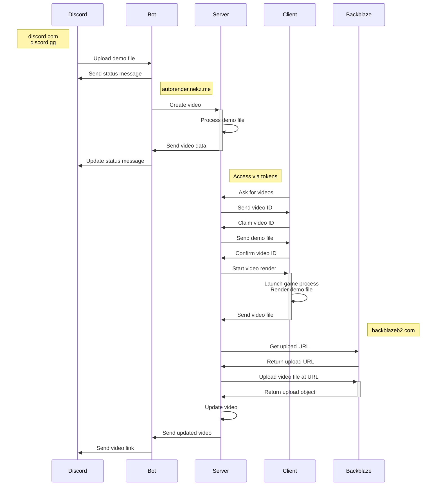

[](https://github.com/NeKzor/autorender/actions/workflows/deno.yml)
[](https://github.com/NeKzor/autorender/actions/workflows/release.yml)

# autorender

Render Portal 2 demos on-demand with: `/render demo <file>`

- [Features](#features)
- [Commands](#commands)
- [Local Development](#local-development)
  - [Network Topology](#network-topology)
  - [Requirements](#requirements)
  - [Setup](#setup)
  - [Install & Run Server](#install--run-server)
    - [.env.server](#srcserverenv)
    - [.env.bot](#srcbotenv)
  - [User Setup](#user-setup)
  - [Storage](#storage)
  - [Install & Run Client](#install--run-client)
  - [Testing](#testing)
  - [Tasks](#tasks)
- [Production](#production)
  - [Server](#server)
  - [Clients](#clients)
  - [Proxy Example with Nginx + Certbot](#proxy-example-with-nginx--certbot)
- [Caveats](#caveats)
- [TODO](#todo)
- [Credits](#credits)
- [License](#license)

## Features

- Render videos on-demand!
- Support for workshop maps, powered by [sdp] and mirror
- Runs in a secure runtime with [Deno]
- Written in 100% TypeScript
- Hosted inside Docker containers

[sdp]: https://github.com/NeKzor/sdp
[Deno]: https://deno.com/runtime

## Commands

| Command           | Description                                                                       |
| ----------------- | --------------------------------------------------------------------------------- |
| `/render demo`    | Render a demo file by uploading it as an attachment.                              |
| `/render link`    | Render an already uploaded demo file from portal2.sr.                             |
| `/render message` | Render an already uploaded demo file by providing a message link or an ID.        |
| `/render latest`  | Render an already uploaded demo file by automatically finding the latest message. |
| `/preset create`  | Create a custom preset for executing render commands.                             |
| `/preset get`     | Display and edit a custom preset.                                                 |
| `/preset delete`  | Delete a created custom preset.                                                   |
| `/preset help`    | Display all available render commands.                                            |
| `/watch latest`   | List latest requested videos.                                                     |
| `/watch random`   | Watch a random requested video.                                                   |
| `/fixup`          | Fix an old Portal 2 demo file to make it work on the latest engine version.       |
| `/bot info`       | Display information about the bot.                                                |

## Local Development

### Network Topology



### Requirements

- [deno runtime] | [Reference](https://deno.land/manual)
- [Discord Application] | [Reference](https://discord.com/developers/docs/getting-started)
- [Docker Engine] | [Reference](https://docs.docker.com/compose/reference)
- [Portal 2]
- Dev-only: [mkcert]
- Optional: [Backblaze Bucket] | [Reference](https://www.backblaze.com/apidocs/introduction-to-the-b2-native-api)

[deno runtime]: https://deno.com/runtime
[Discord Application]: https://discord.com/developers/applications
[Docker Engine]: https://docs.docker.com/engine/install
[Portal 2]: https://store.steampowered.com/app/620
[mkcert]: https://github.com/FiloSottile/mkcert
[Backblaze Bucket]: https://www.backblaze.com

### Setup

- Have the following ready:
  - Discord user ID of the developer account
  - Discord client ID of the application
  - Discord client secret of the application
  - Discord bot token of the application
- Add the OAuth redirect for the Discord application: `https://autorender.portal2.local/login/discord/authorize`
- Enable `message content intent` for the Discord bot application
- Clone the repository and go through the setup process: `deno task setup`
- Build server image: `deno task build`

### Install & Run Server

- Optional: Configure [.env.server](#srcserverenv) file
- Optional: Configure [.env.bot](#srcbotenv) file
- Start all containers: `deno task up`
- Add a host entry `127.0.0.1 autorender.portal2.local` to `/etc/hosts` or `C:\Windows\System32\drivers\etc\hosts`

The server should now be available at `https://autorender.portal2.local` and the bot should be online on Discord.

### .env.server

The redirect URI of the Discord OAuth2 application should be set to:

> `https://autorender.portal2.local/login/discord/authorize`

The domain has to match the value of `AUTORENDER_PUBLIC_URI`.

For development it is recommended to enable `HOT_RELOAD=true`.

| Variable              | Description                                                                         |
| --------------------- | ----------------------------------------------------------------------------------- |
| HOT_RELOAD            | Automatic page reload when the server reloads. Should only be used for development! |
| DISCORD_USER_ID       | Discord user ID of developer account. This is only used to reset the permissions.   |
| DISCORD_CLIENT_ID     | Client ID of the Discord OAuth2 application.                                        |
| DISCORD_CLIENT_SECRET | Client secret of the Discord OAuth2 application.                                    |
| AUTORENDER_PUBLIC_URI | This is used for public links which the server generates.                           |
| AUTORENDER_BOT_TOKEN  | Generated token which is shared between the server and the bot.                     |
| COOKIE_SECRET_KEY     | Non-predictable key used to encrypt/decrypt session cookies.                        |
| B2_ENABLED            | Value `true` enables video storage on Backblaze.                                    |
| B2_BUCKET_ID          | Bucket ID from Backblaze.                                                           |
| B2_KEY_ID             | Key ID from Backblaze.                                                              |
| B2_KEY_NAME           | Key name from Backblaze.                                                            |
| B2_APP_KEY            | App key from Backblaze.                                                             |

#### .env.bot

| Variable             | Description                                                     |
| -------------------- | --------------------------------------------------------------- |
| DISCORD_BOT_TOKEN    | Token of the Discord bot application.                           |
| DISCORD_BOT_ID       | Client ID of the Discord bot application.                       |
| AUTORENDER_BOT_TOKEN | Generated token which is shared between the server and the bot. |

### User Setup

- Create a user account by logging in from the home page
- Make sure that `DISCORD_USER_ID` in the `.env.server` file is the correct user ID of the created user
- Set all permissions for the account with `deno task perm`
- Logout and login again

### Storage

By default all demos and videos are stored locally. Video upload to the b2 cloud storage is optional. However, it is
recommended to use local storage during development since every request to b2 will count towards the daily API cap.

When using b2, a video will be deleted once they have been processed by `deno task processing`. This task is responsible
for generating thumbnails and previews. These files are not uploaded but are stored locally.

### Install & Run Client

- Generate a new token in the platform (make sure the permissions have been set for the [logged in account])
- Start the client `deno task client` and go through the setup process

In [production](#production) the client code will be compiled into a single executable which should also be tested:

- Compile the binary: `deno task compile`
- Run the binary in developer mode: `./src/client/bin/autorenderclient --dev`

[logged in account]: #user-setup

### Testing

There are several demo files in `src/server/tests/demos` which can be used for testing:

- `benchmark.dem` 10 seconds long demo
- `short.dem` 1 second long demo
- `workshop.dem` 10 seconds long demo of a workshop map

### Tasks

The project contains convenient tasks which can be executed with `deno task <name>`.

| Task                     | Description                                                         |
| ------------------------ | ------------------------------------------------------------------- |
| `client`                 | Starts the client.                                                  |
| `client:test`            | Runs all client tests.                                              |
| `client:compile:linux`   | Compiles client code for Linux.                                     |
| `client:compile:windows` | Compiles client code for Windows.                                   |
| `server:test`            | Runs all server tests.                                              |
| `server:debug`           | Connects to the server container.                                   |
| `server:restart`         | Restarts the server container.                                      |
| `server:stop`            | Stops the server container.                                         |
| `bot:debug`              | Connects to the server container.                                   |
| `bot:restart`            | Restarts the bot container.                                         |
| `bot:stop`               | Restarts the bot container.                                         |
| `proxy:debug`            | Connects to the bot container.                                      |
| `proxy:restart`          | Restarts the bot container.                                         |
| `proxy:stop`             | Restarts the bot container.                                         |
| `stale`                  | Automatically clears render queue.                                  |
| `perm`                   | Resets permissions of developer account.                            |
| `board`                  | Automatically checks for videos to render on board.portal2.sr.      |
| `processing`             | Automatically generate thumbnails and previews for uploaded videos. |
| `migrate`                | Migrate videos from autorender v1.                                  |
| `build`                  | Builds server image.                                                |
| `up`                     | Starts all containers.                                              |
| `up:prod`                | Starts all containers in prod environment.                          |
| `down`                   | Removes all containers.                                             |
| `down:prod`              | Removes all containers in prod environment.                         |
| `db`                     | Connect to the database.                                            |
| `db:debug`               | Connect to the database container.                                  |
| `db:stop`                | Stop the database container.                                        |
| `db:restart`             | Restart the database container.                                     |
| `db:dump`                | Create database dump.                                               |
| `setup`                  | Run the setup process.                                              |
| `prod:sync`              | Sync repository files on production server.                         |

## Production

### Server

On the production system the project folder structure will look similar to `docker/volumes` since all source files in
`src/bot`, `src/server` and `src/shared` are inside the created Docker images.

Run the following from a new folder:

```bash
deno run \
  --reload \
  --allow-read=. \
  --allow-write=. \
  --allow-net=raw.githubusercontent.com \
  https://raw.githubusercontent.com/NeKzor/autorender/main/setup.ts --prod
```

> Note: The setup does not ask for b2 credentials which means that the `.env.server` file has to be modified manually.

Running `deno task up` will start all containers. The official autorender images are pulled from Docker Hub. See
[deploy.yml](/.github/workflows/deploy.yml) for an example on how to deploy images.

When deploying an update to the server all repository files can be re-synced with `deno task prod:sync`. This mainly
includes `deno.json`, `deno.lock` and `storage/files`. New keys in `.env` files have to be added manually.

### Clients

All code in `src/client` will be compiled and shipped in a single binary:

```bash
deno task compile --all --release
```

When deploying make sure that clients have checked the following:

- Successful benchmark with: `.\autorenderclient.exe benchmark`
- Steam Overlay is disabled
- Steam client is in offline mode
- Operating system does not enter sleep mode
- Operating system does not power off
- Network connection is stable
- There is nothing else that could interrupt the client

### Proxy Example with Nginx + Certbot

<details>
<summary>View autorender.nekz.me.conf</summary>

```
server {
    listen 80;
    server_name autorender.nekz.me;
    return 301 https://$host$request_uri;
}

server {
    listen 443 ssl http2;
    server_name autorender.nekz.me;

    ssl_certificate /etc/letsencrypt/live/autorender.nekz.me/fullchain.pem; # managed by Certbot
    ssl_certificate_key /etc/letsencrypt/live/autorender.nekz.me/privkey.pem; # managed by Certbot
    include /etc/letsencrypt/options-ssl-nginx.conf; # managed by Certbot
    ssl_dhparam /etc/letsencrypt/ssl-dhparams.pem; # managed by Certbot

    location / {
        proxy_pass http://127.0.0.1:8834$request_uri;
        proxy_set_header Host $host;
        proxy_set_header X-Real-IP $remote_addr;
        proxy_set_header X-Forwarded-For $proxy_add_x_forwarded_for;
        proxy_set_header X-Forwarded-Proto $scheme;
        proxy_buffering off;
	      client_max_body_size 150M;
    }

    location /connect/client {
        proxy_pass http://127.0.0.1:8834$request_uri;
        proxy_http_version 1.1;
        proxy_set_header Upgrade $http_upgrade;
        proxy_set_header Connection "Upgrade";
        proxy_set_header Host $host;
        proxy_set_header X-Real-IP $remote_addr;
        proxy_set_header X-Forwarded-For $proxy_add_x_forwarded_for;
        proxy_set_header X-Forwarded-Proto $scheme;
        proxy_buffering off;
        proxy_read_timeout 1800s;
        proxy_send_timeout 1800s;
    }

    location /api/v1/videos/upload {
        proxy_pass http://127.0.0.1:8834$request_uri;
        proxy_set_header Host $host;
        proxy_set_header X-Real-IP $remote_addr;
        proxy_set_header X-Forwarded-For $proxy_add_x_forwarded_for;
        proxy_set_header X-Forwarded-Proto $scheme;
        proxy_send_timeout 300s;
        proxy_read_timeout 300s;
        proxy_buffering off;
        client_max_body_size 150M;
    }

    location /storage/videos {
        proxy_pass http://127.0.0.1:8834$request_uri;
        proxy_set_header Host $host;
        proxy_set_header X-Real-IP $remote_addr;
        proxy_set_header X-Forwarded-For $proxy_add_x_forwarded_for;
        proxy_set_header X-Forwarded-Proto $scheme;
        proxy_send_timeout 300s;
        proxy_read_timeout 300s;
        proxy_buffering off;
        proxy_force_ranges on;
        client_max_body_size 150M;
    }
}
```

</details>

## Caveats

- Deno
  - LSP does not support a monorepo project setup: [vscode_deno#501]
  - Network permissions do not support wildcards for domains: [deno#6532]
  - Permission system is insanely tedious to maintain: [deno#12763]
  - WebSockets are limited to [64 MiB] per frame which is good enough for demos but not large enough for videos:
    [deno#15809]
- Docker
  - Permissions for containers have to be managed manually for mounted volumes: [moby#2259]
  - MariaDB image does not leak memory but MySQL 8 does: [containerd#6707]
- SourceAutoRecord
  - The autorender client installs a [patched version] of SAR to make it work on the latest version of Portal 2

[vscode_deno#501]: https://github.com/denoland/vscode_deno/issues/501
[deno#6532]: https://github.com/denoland/deno/issues/6532
[deno#12763]: https://github.com/denoland/deno/issues/12763
[moby#2259]: https://github.com/moby/moby/issues/2259
[containerd#6707]: https://github.com/containerd/containerd/issues/6707
[64 MiB]: https://github.com/denoland/fastwebsockets/blob/875e6b7ba001898e38bbff50e8f90cc11b90e718/src/lib.rs#L283
[deno#15809]: https://github.com/denoland/deno/issues/15809
[patched version]: https://github.com/NeKzor/sar/releases

## TODO

> NOTE: Wished features are on a separate list.

- ~~Write own demo fixup tool~~
- ~~Offline storage service~~
- ~~Demo download link~~
- ~~Automatic demo fixup~~
- ~~Markdown links~~
- ~~Quality options~~
- ~~Use yaml format for client settings~~
- ~~Add CI/CD~~
  - ~~CI should check for lint and format errors on every push~~
  - ~~CD should compile client code and release all files on every tag~~
- ~~Package client code~~
  - ~~Installer CLI~~
  - ~~Download SAR/autorender.cfg automatically~~
  - ~~Figure out permissions~~
  - ~~Single executable~~
- ~~Switch to shorter video IDs~~
- Integrate into leaderboards
  - ~~Automatic render~~
  - Send URL to leaderboard
- ~~Advanced render options e.g. sar_ihud~~
- ~~Support more games~~
  - ~~Common Portal 2 mods~~
  - ~~Sourcemods~~
- Bot improvements
  - ~~Edit original interaction message or create a followup message~~
  - ~~Improve `/bot info`~~
  - Add `/preset edit`
  - Update `/preset get` message after edit
- Frontend design
  - Pages
    - ~~Generate video preview + thumbnails~~
    - Video
      - Retry button for failed auto renders
      - Delete button
    - Demo upload
      - Bulk render
    - Profiles
      - Settings
        - Display name
        - Notifications
      - Filter
    - Statistics
      - Charts
    - Search
      - Profiles
      - Filter
    - Notifications
    - Admin tools
      - Users
      - Audit logs
      - All tokens
    - Tokens
      - Reset button
      - Inactive button
  - Implement various data related functions
    - Delete video button
    - Delete data button
    - Request data button
- Misc
  - Improve code
    - Refactor routes
    - Refactor connections
  - Improve logging
    - Fix logging library or find a better one
    - Improve error logging
    - Add file logging to bot
  - Improve testing
    - Implement test render
    - Allow multiple game instances
    - Fake a game instance
    - Enable tests in CI
  - ~~Better dev setup~~
    - ~~Docker~~
    - ~~HTTPS~~
    - ~~Cross-platform setup script~~
    - ~~Usage of import map~~
  - Improve documentation
    - Document client setup
    - Use static site generator
  - Improve server deployment
    - Build server image in CI for minimal setup
    - Deploy from GitHub runner
- SAR wishlist
  - ~~Remove unnecessary watermark~~
  - ~~Sandbox commands like in 1.0~~ `sar_demo_blacklist_all` exists now, nice
  - ~~IPC between client and game process~~ `-netconport` might be good enough
  - Detect if demo could be played
  - Do not lock mouse input inside the game during render
  - Encode button inputs per frame for
    - Toggleable overlay
    - Accurate visualisation
- Leaderboard wishlist
  - Set filename in Content-Disposition for demos
  - Add endpoint for setting autorender videos

## Credits

- [@PortalRex] for idea and motivation
- [@ThatFridgeFella] for testing and feedback
- [@ThisAMJ] for quickhud files and for removing my only easter egg in SAR :(
- [p2sr/demofixup] for an almost working demo fixup method
- [p2sr/SourceAutoRecord] for renderer crashes and many other bugs
- [p2sr/portal2-cm-autorender] for making me not want to use Python

[@PortalRex]: https://github.com/PortalRex
[@ThatFridgeFella]: https://github.com/ThatFridgeFella
[@ThisAMJ]: https://github.com/ThisAMJ
[p2sr/demofixup]: https://github.com/p2sr/demofixup
[p2sr/SourceAutoRecord]: https://github.com/p2sr/SourceAutoRecord
[p2sr/portal2-cm-autorender]: https://github.com/p2sr/portal2-cm-autorender

## License

[MIT License](./LICENSE)
