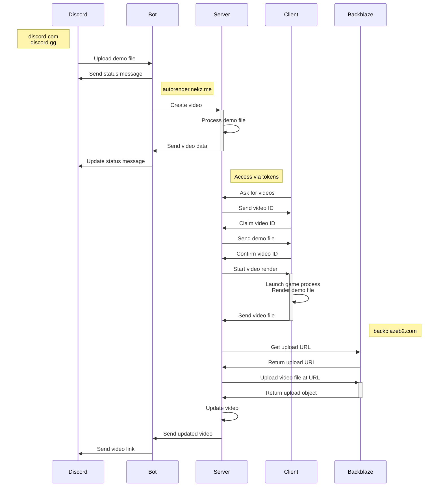

# autorender

Convert Portal 2 demos into videos with: `/render demo <file>`

- [Features](#features)
- [Commands](#commands)
- [Local Development](#local-development)
  - [Network Topology](#network-topology)
  - [Storage](#storage)
  - [Requirements](#requirements)
  - [Setup](#setup)
  - [Install & Run Server](#install--run-server)
  - [User Setup](#user-setup)
    - [src/server/.env](#srcserverenv)
  - [Install & Run Client](#install--run-client)
    - [src/client/.env](#srcclientenv)
  - [Install & Run Bot](#install--run-bot)
    - [src/bot/.env](#srcbotenv)
  - [Caveats](#caveats)
- [Production](#production)
  - [Proxy Example with Nginx + Certbot](#proxy-example-with-nginx--certbot)
- [TODO](#todo)
- [Credits](#credits)
- [License](#license)

## Features

- Render videos On-Demand!
- Support for workshop maps, powered by [mirror.nekz.me]
- Render files directly in the web platform (TODO)
- Runs in a secure runtime with [Deno]
- Written in 100% TypeScript
- Hosted inside Docker containers (TODO)

[mirror.nekz.me]: https://github.com/NeKzor/mirror
[Deno]: https://deno.com/runtime

## Commands

|Command|Description|
|---|---|
|`/render demo`|Render a demo file by uploading it as an attachment.|
|`/render message`|Render an already uploaded demo file by providing the message link or the ID of the message.|
|`/render latest`|Render an already uploaded demo file by automatically finding the latest message within the current channel.|
|`/watch latest`|List latest requested videos.|
|`/watch random`|Watch a random requested video.|
|`/fixup`|Fix an old Portal 2 demo file to make it work on the latest engine version.|

## Local Development

### Network Topology



### Requirements

- [deno runtime]
- [FFmpeg]
- [Discord Application]
- [Docker Engine]
- [Backblaze Bucket] (optional)
- [mkcert] (optional)
- [demofixup] (optional)

[deno runtime]: https://deno.com/runtime
[FFmpeg]: https://ffmpeg.org/download.html
[Discord Application]: https://discord.com/developers/applications
[Backblaze Bucket]: https://www.backblaze.com
[Docker Engine]: https://docs.docker.com/engine/install
[mkcert]: https://github.com/FiloSottile/mkcert
[demofixup]: https://github.com/p2sr/demofixup

### Setup

Generate files with: `chmod +x setup && ./setup dev`

### Install & Run Server

- Configure `src/server/.env` file
- Build the server image once with: `docker compose build`
- Start all containers with: `docker compose up`
- Add a host entry `127.0.0.1 autorender.portal2.local` to `/etc/hosts`
- Run from the server folder `src/server` the command `deno task start:dev`

The server should now be available at: `http://autorender.portal2.local`

### User Setup

- Create the user account once by logging in from the home page
- Make sure that `DISCORD_USER_ID` in the `src/server/.env` file is the correct user ID of the created user
- Set all permissions for the account with `deno task dev`
- Logout and login again

### Storage

By default all demos and videos are stored locally. Video upload to the b2 cloud storage is optional. However, it is
recommended to use local storage during development since every request to b2 will count towards the daily API cap.

### src/server/.env

|Variable|Description|
|---|---|
|HOT_RELOAD|Automatic page reload when the server reloads. Should only be used for development!|
|DISCORD_USER_ID|Discord user ID of developer account. This is only used to reset the permissions.|
|DISCORD_CLIENT_ID|Client ID of the Discord OAuth2 application.|
|DISCORD_CLIENT_SECRET|Client secret of the Discord OAuth2 application.|
|AUTORENDER_PUBLIC_URI|This is used for public links which the server generates e.g. the redirect URI of the Discord OAuth2 application.|
|AUTORENDER_BOT_TOKEN|Generated token which is shared between the server and the bot.<br>Example: `openssl rand -hex 12`|
|COOKIE_SECRET_KEY|Non-predictable key used to encrypt/decrypt session cookies.|
|B2_ENABLED|Value `yes` enables video storage on Backblaze.|
|B2_BUCKET_ID|Bucket ID from Backblaze.|
|B2_KEY_ID|Key ID from Backblaze.|
|B2_KEY_NAME|Key name from Backblaze.|
|B2_APP_KEY|App key from Backblaze.|

### Install & Run Client

- Install [fixed version of SourceAutoRecord]
- Copy `autorender.cfg` into the game's `cfg` directory
- Log into the platform
- Generate a new token in the platform (make sure the permissions have been set for the logged in account)
- Copy generated token into the `src/client/.env` file as `AUTORENDER_API_KEY`
- Run from the client folder `src/client` the command `deno task start:dev`

[fixed version of SourceAutoRecord]: https://github.com/NeKzor/sar/releases/tag/autorender

#### src/client/.env

|Variable|Description|
|---|---|
|GAME_DIR|Directory path of the game.|
|GAME_EXE|The binary or script to execute: `portal2.exe` (Windows) `portal2.sh` (Linux).|
|GAME_PROC|The process name of the game: `portal2.exe` (Windows) `portal2_linux` (Linux).|
|AUTORENDER_API_KEY|Access token for autorender server.|

### Install & Run Bot

- Copy the bot credentials of the Discord application into the `src/bot/.env` file
- Configure `AUTORENDER_BOT_TOKEN` with the same password that is shared with the server
- Run from the bot folder `src/bot` the command `deno task start:dev`

#### src/bot/.env

|Variable|Description|
|---|---|
|DISCORD_BOT_TOKEN|Token of the Discord bot application.|
|DISCORD_BOT_ID|Client ID of the Discord bot application.|
|AUTORENDER_BOT_TOKEN|Generated token which is shared between the server and the bot.|

### Caveats

- Deno's network permissions do not support wildcards for domains: [deno#6532]
- Deno's WebSockets are limited to [64 MiB] which is good enough for demos but not for large video files: [deno#15809]
- Permissions for containers have to be managed manually for mounted volumes: [moby#2259]
- MariaDB image does not leak memory but MySQL 8 does: [containerd#6707]

[deno#6532]: https://github.com/denoland/deno/issues/6532
[moby#2259]: https://github.com/moby/moby/issues/2259
[containerd#6707]: https://github.com/containerd/containerd/issues/6707
[64 MiB]:  https://github.com/denoland/fastwebsockets/blob/875e6b7ba001898e38bbff50e8f90cc11b90e718/src/lib.rs#L283
[deno#15809]: https://github.com/denoland/deno/issues/15809

## Production

Same as in development but all task commands end with `prod` e.g. `deno task start:prod`.

Make sure the bot's `.env` file has the correct values for:
- `AUTORENDER_BASE_API` should point to the internal address
- `AUTORENDER_PUBLIC_URI` should point to the public domain (used for sending the final Discord message)

### Proxy Example with Nginx + Certbot

```
server {
    listen 80;
    server_name autorender.nekz.me;
    return 301 https://$host$request_uri;
}

server {
    listen 443 ssl http2;
    server_name autorender.nekz.me;

    ssl_certificate /etc/letsencrypt/live/autorender.nekz.me/fullchain.pem; # managed by Certbot
    ssl_certificate_key /etc/letsencrypt/live/autorender.nekz.me/privkey.pem; # managed by Certbot
    include /etc/letsencrypt/options-ssl-nginx.conf; # managed by Certbot
    ssl_dhparam /etc/letsencrypt/ssl-dhparams.pem; # managed by Certbot

    location / {
        proxy_pass http://127.0.0.1:8834$request_uri;
        proxy_set_header Host $host;
        proxy_set_header X-Real-IP $remote_addr;
        proxy_set_header X-Forwarded-For $proxy_add_x_forwarded_for;
        proxy_set_header X-Forwarded-Proto $scheme;
        proxy_buffering off;
	      client_max_body_size 150M;
    }

    location /connect/client/ {
        proxy_pass http://127.0.0.1:8834$request_uri;
        proxy_http_version 1.1;
        proxy_set_header Upgrade $http_upgrade;
        proxy_set_header Connection "Upgrade";
        proxy_set_header Host $host;
        proxy_set_header X-Real-IP $remote_addr;
        proxy_set_header X-Forwarded-For $proxy_add_x_forwarded_for;
        proxy_set_header X-Forwarded-Proto $scheme;
        proxy_buffering off;
        proxy_read_timeout 1800s;
        proxy_send_timeout 1800s;
    }
}
```

## TODO

- ~~Write own demo fixup tool~~
- ~~Offline storage service~~
- ~~Demo download link~~
- ~~Automatic demo fixup~~
- ~~Markdown links~~
- ~~Quality options~~
- ~~Use yaml format for client settings~~
- Support game mods
- Switch to shorter video IDs
- Edit original interaction message or create a follow up message
- Advanced render options e.g. sar_ihud
- Integrate into [board.nekz.me]
- Design frontend platform
  - Profiles
  - Search
  - Users
  - Audit logs
  - Demo upload
- Package client code
  - ~~Installer CLI~~
  - ~~Download SAR/autorender.cfg automatically~~
  - Figure out permissions
  - Single executable
- Generate video preview + thumbnails
- Unlisted/private videos
- Figure out docker
- Write a CLI tool for dev setup
- Implement various data related functions
  - Delete video button
    - Delete video from cloud storage
  - Delete data button
    - Delete all user videos
    - Delete all user token data
    - Delete all videos from cloud storage
  - Request data button
    - Request all user data
- SAR wishlist:
  - ~~Remove unnecessary watermark~~
  - Sandbox commands like in 1.0
  - IPC between client and game process
  - Detect if demo could be played
  - Do not capture mouse input during render
  - Remove Steam requirement
- Figure out a way to deploy this to GPU instances (DepotDownloader?)
- Clean up some anti-patterns, code duplications etc.

[board.nekz.me]: https://github.com/NeKzor/board

## Credits

- [@PortalRex] for idea and motivation
- [@ThatFridgeFella] for testing
- [p2sr/demofixup] for an an almost working demo fixup method!
- [p2sr/SourceAutoRecord] for a renderer crashes!
- [p2sr/portal2-cm-autorender] for making me not want to use Python!!

[@PortalRex]: https://github.com/PortalRex
[@ThatFridgeFella]: https://github.com/ThatFridgeFella
[p2sr/demofixup]: https://github.com/p2sr/demofixup
[p2sr/SourceAutoRecord]: https://github.com/p2sr/SourceAutoRecord
[p2sr/portal2-cm-autorender]: https://github.com/p2sr/portal2-cm-autorender

## License

[MIT License](./LICENSE)
