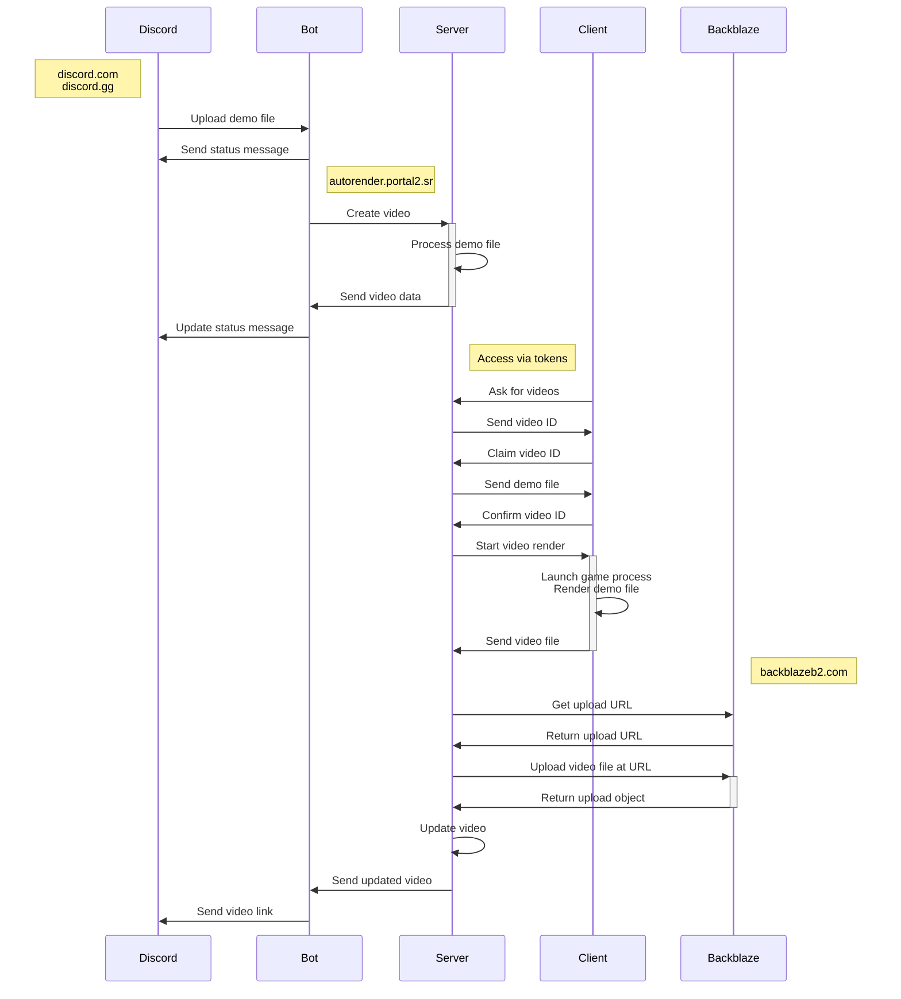

[](https://github.com/NeKzor/autorender/actions/workflows/deno.yml)
[](https://github.com/NeKzor/autorender/actions/workflows/release.yml)

# autorender

Render Portal 2 demos on-demand with: `/render demo <file>`

- [Features](#features)
- [Commands](#commands)
- [Local Development](#local-development)
  - [Network Topology](#network-topology)
  - [Requirements](#requirements)
  - [Setup](#setup)
  - [Install & Run Server](#install--run-server)
    - [.env.server](#srcserverenv)
    - [.env.bot](#srcbotenv)
  - [User Setup](#user-setup)
  - [Storage](#storage)
  - [Install & Run Client](#install--run-client)
  - [Testing Renders](#testing-renders)
  - [Testing Board Connection](#testing-board-connection)
  - [Tasks](#tasks)
- [Production](#production)
  - [Server](#server)
  - [Clients](#clients)
  - [Reverse Proxy](#reverse-proxy)
- [Caveats](#caveats)
- [Credits](#credits)
- [License](#license)

## Features

- Render videos on-demand!
- Support for mods and workshop maps, powered by mirror
- Automatic fixup of old demos, powered by [sdp]
- Runs in a secure runtime using [Deno]
- Written in 100% TypeScript
- Hosted inside Docker containers

[sdp]: https://github.com/NeKzor/sdp
[Deno]: https://deno.com/runtime

## Commands

| Command           | Description                                                                       |
| ----------------- | --------------------------------------------------------------------------------- |
| `/render demo`    | Render a demo file by uploading it as an attachment.                              |
| `/render link`    | Render an already uploaded demo file from portal2.sr.                             |
| `/render message` | Render an already uploaded demo file by providing a message link or an ID.        |
| `/render latest`  | Render an already uploaded demo file by automatically finding the latest message. |
| `/preset create`  | Create a custom preset for executing render commands.                             |
| `/preset get`     | Show a custom preset.                                                             |
| `/preset edit`    | Edit a custom preset.                                                             |
| `/preset delete`  | Delete a created custom preset.                                                   |
| `/preset help`    | Show all available render commands.                                               |
| `/watch latest`   | List latest requested videos.                                                     |
| `/watch random`   | Watch a random requested video.                                                   |
| `/fixup`          | Fix an old Portal 2 demo file to make it work on the latest engine version.       |
| `/bot info`       | Show information about the bot.                                                   |

## Local Development

### Network Topology



### Requirements

- [deno runtime] | [Reference](https://deno.land/manual)
- [Discord Application] | [Reference](https://discord.com/developers/docs/getting-started)
- [Docker Engine] | [Reference](https://docs.docker.com/compose/reference)
- [Portal 2]
- Dev-only: [mkcert]
- Optional: [Backblaze Bucket] | [Reference](https://www.backblaze.com/apidocs/introduction-to-the-b2-native-api)

[deno runtime]: https://deno.com/runtime
[Discord Application]: https://discord.com/developers/applications
[Docker Engine]: https://docs.docker.com/engine/install
[Portal 2]: https://store.steampowered.com/app/620
[mkcert]: https://github.com/FiloSottile/mkcert
[Backblaze Bucket]: https://www.backblaze.com

### Setup

- Have the following ready:
  - Discord user ID of the developer account
  - Discord client ID of the application
  - Discord client secret of the application
  - Discord bot token of the application
- Add the OAuth redirect for the Discord application: `https://autorender.portal2.local/login/discord/authorize`
- Enable `message content intent` for the Discord bot application
- Clone the repository and go through the setup process: `deno task setup`
- Build server image: `deno task build`

### Install & Run Server

- Optional: Configure [.env.server](#srcserverenv) file
- Optional: Configure [.env.bot](#srcbotenv) file
- Start all containers: `deno task up`
- Add a host entry `127.0.0.1 autorender.portal2.local` to `/etc/hosts` or `C:\Windows\System32\drivers\etc\hosts`

The server should now be available at `https://autorender.portal2.local` and the bot should be online on Discord.

### .env.server

The redirect URI of the Discord OAuth2 application should be set to:

> `https://autorender.portal2.local/login/discord/authorize`

The domain has to match the value of `AUTORENDER_PUBLIC_URI`.

For development it is recommended to enable `HOT_RELOAD=true`.

| Variable              | Description                                                                         |
| --------------------- | ----------------------------------------------------------------------------------- |
| HOT_RELOAD            | Automatic page reload when the server reloads. Should only be used for development! |
| DISCORD_USER_ID       | Discord user ID of developer account. This is only used to reset the permissions.   |
| DISCORD_CLIENT_ID     | Client ID of the Discord OAuth2 application.                                        |
| DISCORD_CLIENT_SECRET | Client secret of the Discord OAuth2 application.                                    |
| AUTORENDER_PUBLIC_URI | This is used for public links which the server generates.                           |
| AUTORENDER_BOT_TOKEN  | Generated token which is shared between the server and the bot.                     |
| COOKIE_SECRET_KEY     | Non-predictable key used to encrypt/decrypt session cookies.                        |
| B2_ENABLED            | Value `true` enables video storage on Backblaze.                                    |
| B2_BUCKET_ID          | Bucket ID from Backblaze.                                                           |
| B2_KEY_ID             | Key ID from Backblaze.                                                              |
| B2_KEY_NAME           | Key name from Backblaze.                                                            |
| B2_APP_KEY            | App key from Backblaze.                                                             |

#### .env.bot

| Variable             | Description                                                     |
| -------------------- | --------------------------------------------------------------- |
| DISCORD_BOT_TOKEN    | Token of the Discord bot application.                           |
| DISCORD_BOT_ID       | Client ID of the Discord bot application.                       |
| AUTORENDER_BOT_TOKEN | Generated token which is shared between the server and the bot. |

### User Setup

- Create a user account by logging in from the home page
- Make sure that `DISCORD_USER_ID` in the `.env.server` file is the correct user ID of the created user
- Set all permissions for the account with `deno task perm`
- Logout and login again

### Storage

By default all demos and videos are stored locally. Video upload to the b2 cloud storage is optional. However, it is
recommended to use local storage during development since every request to b2 will count towards the daily API cap.

When using b2, a video will be deleted once they have been processed by `deno task processing`. This task is responsible
for generating thumbnails and previews. These files are not uploaded but are stored locally.

### Install & Run Client

- Generate a new token in the platform (make sure the permissions have been set for the [logged in account])
- Start the client `deno task client` and go through the setup process

In [production](#production) the client code will be compiled into a single executable which should also be tested:

- Compile the binary: `deno task compile`
- Run the binary in developer mode: `./src/client/bin/autorenderclient --dev`

[logged in account]: #user-setup

### Testing Renders

There are several demo files in `src/server/tests/demos` which can be used for testing:

- `benchmark.dem` 10 seconds long demo
- `short.dem` 1 second long demo
- `workshop.dem` 10 seconds long demo of a workshop map

### Testing Board Connection

> NOTE: Optional.

Since mel.board.portal2.sr and the new v3 API it is possible to send the autorender result directly to the leaderboard.
Testing this locally requires a partial setup of the [board repository](https://github.com/NeKzor/board). A build of the
board image is not required since it will be pulled from
[Docker Hub](https://hub.docker.com/repository/docker/p2sr/mel-board).

- Create a symlink: `ln -s /path/to/board/repository board-net`
- Set a random API token that will be shared in both projects:
  - MEL_BOARD_API_TOKEN in `docker/volumes/.env.server`
  - autorender_api_token in `board-net/.config.json`
- Copy docker compose file: `cp docker/compose/board-net.yml docker-compose.yml`
- Run `deno task up`
- Run `deno task test` once all containers are up

Because of proxy differences (board = apache2 vs autorender = nginx) the board has to be accessed via a port
`https://board.portal2.local:4443/`. Inside the docker container it will be alias to `https://board-server/`.

### Tasks

The project contains convenient tasks which can be executed with `deno task <name>`.

| Task                     | Description                                                         |
| ------------------------ | ------------------------------------------------------------------- |
| `check`                  | Checks for format/lint/type errors.                                 |
| `check:types`            | Checks for type errors only.                                        |
| `client`                 | Starts the client.                                                  |
| `client:test`            | Runs all client tests.                                              |
| `client:compile:linux`   | Compiles client code for Linux.                                     |
| `client:compile:windows` | Compiles client code for Windows.                                   |
| `server:test`            | Runs all server tests.                                              |
| `server:debug`           | Connects to the server container.                                   |
| `server:restart`         | Restarts the server container.                                      |
| `server:stop`            | Stops the server container.                                         |
| `bot:debug`              | Connects to the server container.                                   |
| `bot:restart`            | Restarts the bot container.                                         |
| `bot:stop`               | Restarts the bot container.                                         |
| `proxy:debug`            | Connects to the bot container.                                      |
| `proxy:restart`          | Restarts the bot container.                                         |
| `proxy:stop`             | Restarts the bot container.                                         |
| `stale`                  | Automatically clears render queue.                                  |
| `perm`                   | Resets permissions of developer account.                            |
| `board`                  | Automatically checks for videos to render on board.portal2.sr.      |
| `processing`             | Automatically generate thumbnails and previews for uploaded videos. |
| `migrate`                | Migrate videos from autorender v1.                                  |
| `build`                  | Builds server image.                                                |
| `up`                     | Starts all containers.                                              |
| `up:prod`                | Starts all containers in prod environment.                          |
| `down`                   | Removes all containers.                                             |
| `down:prod`              | Removes all containers in prod environment.                         |
| `db`                     | Connect to the database.                                            |
| `db:debug`               | Connect to the database container.                                  |
| `db:stop`                | Stop the database container.                                        |
| `db:restart`             | Restart the database container.                                     |
| `db:dump`                | Create database dump.                                               |
| `setup`                  | Run the setup process.                                              |
| `prod:sync`              | Sync repository files on production server.                         |
| `prod:update`            | Updates Docker images, syncs files and restarts containers.         |

## Production

### Server

On the production system the project folder structure will look similar to `docker/volumes` since all source files in
`src/bot`, `src/server` and `src/shared` are inside the created Docker images.

Run the following from a new folder:

```bash
deno run \
  --reload \
  --allow-read=. \
  --allow-write=. \
  --allow-net=raw.githubusercontent.com \
  https://raw.githubusercontent.com/NeKzor/autorender/main/setup.ts --prod
```

> Note: The setup does not ask for b2 credentials which means that the `.env.server` file has to be modified manually.

Running `deno task up` will start all containers. The official autorender images are pulled from [Docker Hub].

When deploying an update to the server all repository files have to be synced again which mainly includes `deno.json`,
`deno.lock`, `storage/initdb` and `storage/files`. New keys in `.env` files have to be added manually.

The command `deno task prod:update` will pull the latest images, sync all files and recreate the containers.

[Docker Hub]: https://hub.docker.com/orgs/p2sr/repositories

### Clients

The code in `src/client` will be compiled and shipped in a single binary:

```bash
deno task compile --all --release
```

When deploying make sure that clients have checked the following:

- Successful benchmark with: `.\autorenderclient.exe benchmark`
- Steam Overlay is disabled
- Steam client is in offline mode
- Operating system does not enter sleep mode
- Operating system does not power off
- Network connection is stable
- There is nothing else that could interrupt the client

### Reverse Proxy

- [With Nginx](/docker/volumes/nginx/autorender.portal2.local.conf.template) (Note: template file)
- [With lighttpd](/docker/volumes/nginx/autorender.portal2.local.conf.template)

## Caveats

- Deno
  - LSP does not support a monorepo project setup: [vscode_deno#501]
  - Network permissions do not support wildcards for domains: [deno#6532]
  - Permission system is insanely tedious to maintain: [deno#12763]
- Docker
  - Permissions for containers have to be managed manually for mounted volumes: [moby#2259]
  - MariaDB image does not leak memory but MySQL 8 does: [containerd#6707]

[vscode_deno#501]: https://github.com/denoland/vscode_deno/issues/501
[deno#6532]: https://github.com/denoland/deno/issues/6532
[deno#12763]: https://github.com/denoland/deno/issues/12763
[moby#2259]: https://github.com/moby/moby/issues/2259
[containerd#6707]: https://github.com/containerd/containerd/issues/6707

## Credits

- [@PortalRex] for idea and motivation
- [@ThatFridgeFella] for testing and feedback
- [@ThisAMJ] for quickhud files and for removing my only easter egg in SAR :(
- [@mlugg] for an almost working demo fixup method
- [p2sr/SourceAutoRecord] for renderer crashes and many other bugs
- [p2sr/portal2-autorender-v1] for making me not want to use Python

[@PortalRex]: https://github.com/PortalRex
[@ThatFridgeFella]: https://github.com/ThatFridgeFella
[@ThisAMJ]: https://github.com/ThisAMJ
[@mlugg]: https://github.com/mlugg
[p2sr/SourceAutoRecord]: https://github.com/p2sr/SourceAutoRecord
[p2sr/portal2-autorender-v1]: https://github.com/p2sr/portal2-autorender-v1

## License

[MIT License](./LICENSE)
