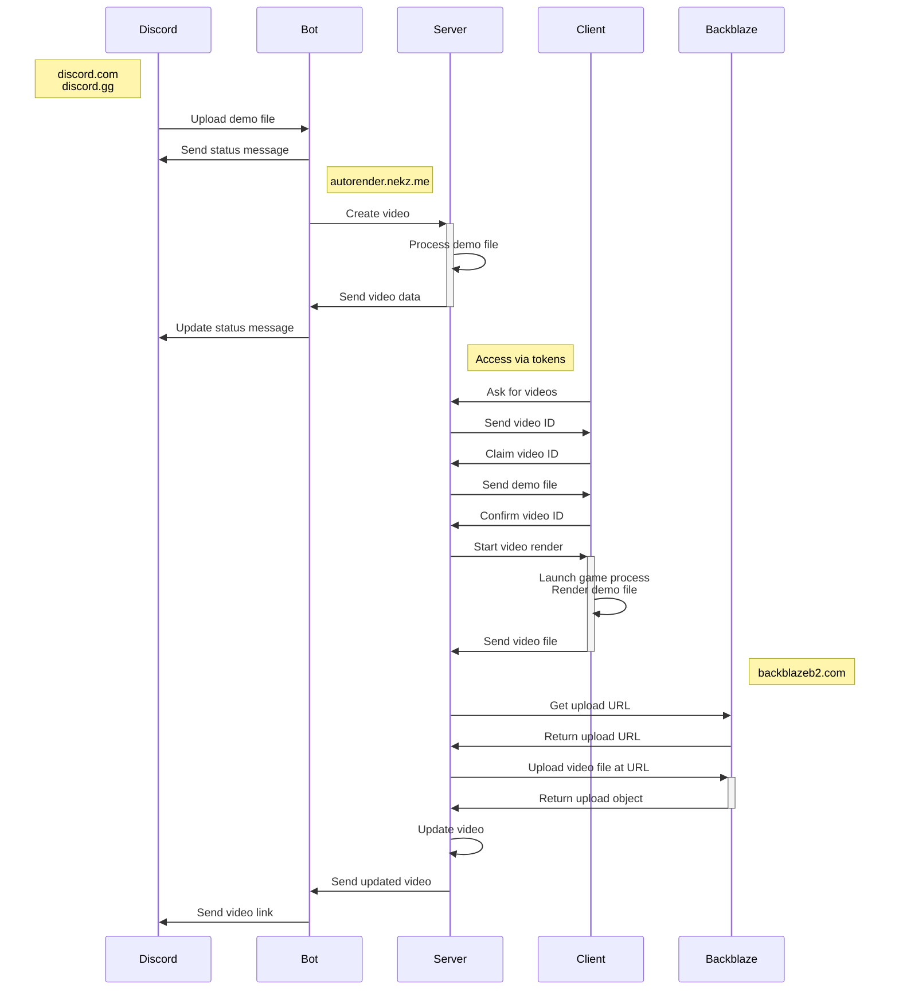

# autorender

Convert Portal 2 demos into videos with: `/render demo <file>`

- [Features](#features)
- [Commands](#commands)
- [Local Development](#local-development)
  - [Network Topology](#network-topology)
  - [Requirements](#requirements)
  - [Setup](#setup)
  - [Install & Run Server](#install--run-server)
  - [User Setup](#user-setup)
  - [Storage](#storage)
    - [src/server/.env](#srcserverenv)
  - [Install & Run Client](#install--run-client)
  - [Install & Run Bot](#install--run-bot)
    - [src/bot/.env](#srcbotenv)
  - [Debugging Database](#debugging-database)
- [Production](#production)
  - [Proxy Example with Nginx + Certbot](#proxy-example-with-nginx--certbot)
- [TODO](#todo)
- [Caveats](#caveats)
- [Credits](#credits)
- [License](#license)

## Features

- Render videos On-Demand!
- Support for workshop maps, powered by [sdp] and mirror
- Render files directly in the web platform (TODO)
- Runs in a secure runtime with [Deno]
- Written in 100% TypeScript
- Hosted inside Docker containers (TODO)

[sdp]: https://github.com/NeKzor/sdp
[Deno]: https://deno.com/runtime

## Commands

| Command           | Description                                                                                  |
| ----------------- | -------------------------------------------------------------------------------------------- |
| `/render demo`    | Render a demo file by uploading it as an attachment.                                         |
| `/render link`    | Render an already uploaded demo file from portal2.sr.                                        |
| `/render message` | Render an already uploaded demo file by providing the message link or the ID of the message. |
| `/render latest`  | Render an already uploaded demo file by automatically finding the latest message.            |
| `/watch latest`   | List latest requested videos.                                                                |
| `/watch random`   | Watch a random requested video.                                                              |
| `/fixup`          | Fix an old Portal 2 demo file to make it work on the latest engine version.                  |

## Local Development

### Network Topology



### Requirements

- [deno runtime]
- [FFmpeg]
- [Discord Application]
- [Docker Engine]
- [Portal 2]
- [Backblaze Bucket] (optional)
- [mkcert] (optional)

[deno runtime]: https://deno.com/runtime
[FFmpeg]: https://ffmpeg.org/download.html
[Discord Application]: https://discord.com/developers/applications
[Docker Engine]: https://docs.docker.com/engine/install
[Portal 2]: https://store.steampowered.com/app/620
[Backblaze Bucket]: https://www.backblaze.com
[mkcert]: https://github.com/FiloSottile/mkcert

### Setup

Generate files with: `chmod +x setup && ./setup dev`

### Install & Run Server

- Configure `src/server/.env` file
- Build the server image once with: `docker compose build`
- Start all containers with: `docker compose up`
- Add a host entry `127.0.0.1 autorender.portal2.local` to `/etc/hosts`
- Start the server with `deno task server:dev`

The server should now be available at: `http://autorender.portal2.local`

### User Setup

- Create the user account once by logging in from the home page
- Make sure that `DISCORD_USER_ID` in the `src/server/.env` file is the correct user ID of the created user
- Set all permissions for the account with `deno task server:perm`
- Logout and login again

### Storage

By default all demos and videos are stored locally. Video upload to the b2 cloud storage is optional. However, it is
recommended to use local storage during development since every request to b2 will count towards the daily API cap.

### src/server/.env

| Variable              | Description                                                                         |
| --------------------- | ----------------------------------------------------------------------------------- |
| HOT_RELOAD            | Automatic page reload when the server reloads. Should only be used for development! |
| DISCORD_USER_ID       | Discord user ID of developer account. This is only used to reset the permissions.   |
| DISCORD_CLIENT_ID     | Client ID of the Discord OAuth2 application.                                        |
| DISCORD_CLIENT_SECRET | Client secret of the Discord OAuth2 application.                                    |
| AUTORENDER_PUBLIC_URI | This is used for public links which the server generates.<sup>1</sup>               |
| AUTORENDER_BOT_TOKEN  | Generated token which is shared between the server and the bot.<sup>2</sup>         |
| COOKIE_SECRET_KEY     | Non-predictable key used to encrypt/decrypt session cookies.                        |
| B2_ENABLED            | Value `true` enables video storage on Backblaze.                                    |
| B2_BUCKET_ID          | Bucket ID from Backblaze.                                                           |
| B2_KEY_ID             | Key ID from Backblaze.                                                              |
| B2_KEY_NAME           | Key name from Backblaze.                                                            |
| B2_APP_KEY            | App key from Backblaze.                                                             |

<sup>1</sup> Example: the redirect URI of the Discord OAuth2 application

<sup>2</sup> Example: `openssl rand -hex 12`

### Install & Run Client

- Generate a new token in the platform (make sure the permissions have been set for the [logged in account])
- Start the client `deno task client:dev` and go through the setup process

In [production](#production) the client code will be compiled into a single executable which should also be tested:

- Compile the binary for your OS with `deno task client:compile:<linux|windows>`
- Run the binary in developer mode with `./src/client/bin/autorenderclient --dev`

[logged in account]: #user-setup

### Install & Run Bot

- Copy the bot credentials of the Discord application into the `src/bot/.env` file
- Configure `AUTORENDER_BOT_TOKEN` with the same password that is shared with the server
- Start the bot with `deno task bot:dev`

#### src/bot/.env

| Variable             | Description                                                     |
| -------------------- | --------------------------------------------------------------- |
| DISCORD_BOT_TOKEN    | Token of the Discord bot application.                           |
| DISCORD_BOT_ID       | Client ID of the Discord bot application.                       |
| AUTORENDER_BOT_TOKEN | Generated token which is shared between the server and the bot. |

### Debugging Database

A [my.cnf file] can be created to connect to the database without having to re-enter the credentials all the time:

`docker exec -ti p2render-db bash -c 'printf [client]\\nuser=${MARIADB_USER}\\npassword=${MARIADB_PASSWORD}\\ndatabase=${MARIADB_DATABASE} > /etc/my.cnf'`

Then connect to the database with: `docker exec -ti p2render-db mariadb`

[my.cnf file]: https://mariadb.com/kb/en/configuring-mariadb-with-option-files

## Production

Same as in development but `prod` is used as a postfix: `deno task <server|bot>:prod`

Make sure that the `src/bot/.env` file has the correct values for:

- `AUTORENDER_BASE_API` should point to the internal address of the host, if hosted within the same network
- `AUTORENDER_PUBLIC_URI` should point to the public domain (used for sending the final Discord message)

For clients we only want to ship a single binary:

- `deno task client:compile:linux` outputs the executable to `src/client/bin/autorenderclient`
- `deno task client:compile:windows` outputs the executable to `src/client/bin/autorenderclient.exe`

When deploying make sure that clients have checked the following:

- The game can be launched from the terminal
- Game updates are disabled
- Steam client is in offline mode
- Operating system does not enter sleep mode
- Operating system does not power off
- Network connection is stable
- There is nothing else that could interrupt the autorender

### Proxy Example with Nginx + Certbot

```
server {
    listen 80;
    server_name autorender.nekz.me;
    return 301 https://$host$request_uri;
}

server {
    listen 443 ssl http2;
    server_name autorender.nekz.me;

    ssl_certificate /etc/letsencrypt/live/autorender.nekz.me/fullchain.pem; # managed by Certbot
    ssl_certificate_key /etc/letsencrypt/live/autorender.nekz.me/privkey.pem; # managed by Certbot
    include /etc/letsencrypt/options-ssl-nginx.conf; # managed by Certbot
    ssl_dhparam /etc/letsencrypt/ssl-dhparams.pem; # managed by Certbot

    location / {
        proxy_pass http://127.0.0.1:8834$request_uri;
        proxy_set_header Host $host;
        proxy_set_header X-Real-IP $remote_addr;
        proxy_set_header X-Forwarded-For $proxy_add_x_forwarded_for;
        proxy_set_header X-Forwarded-Proto $scheme;
        proxy_buffering off;
	      client_max_body_size 150M;
    }

    location /connect/client/ {
        proxy_pass http://127.0.0.1:8834$request_uri;
        proxy_http_version 1.1;
        proxy_set_header Upgrade $http_upgrade;
        proxy_set_header Connection "Upgrade";
        proxy_set_header Host $host;
        proxy_set_header X-Real-IP $remote_addr;
        proxy_set_header X-Forwarded-For $proxy_add_x_forwarded_for;
        proxy_set_header X-Forwarded-Proto $scheme;
        proxy_buffering off;
        proxy_read_timeout 1800s;
        proxy_send_timeout 1800s;
    }
}
```

## TODO

> NOTE: Wished features are on a separate list.

- ~~Write own demo fixup tool~~
- ~~Offline storage service~~
- ~~Demo download link~~
- ~~Automatic demo fixup~~
- ~~Markdown links~~
- ~~Quality options~~
- ~~Use yaml format for client settings~~
- ~~Add CI/CD~~
  - ~~CI should check for lint and format errors on every push~~
  - ~~CD should compile client code and release all files on every tag~~
- ~~Package client code~~
  - ~~Installer CLI~~
  - ~~Download SAR/autorender.cfg automatically~~
  - ~~Figure out permissions~~
  - ~~Single executable~~
- ~~Switch to shorter video IDs~~
- Integrate into leaderboards
  - ~~Automatic render~~
  - Send URL to leaderboard
- ~~Advanced render options e.g. sar_ihud~~
- Support game mods
- Bot improvements
  - Edit original interaction message or create a follow up message
  - ~~Improve `/bot info`~~
- Design frontend platform
  - Pages
    - Profiles
    - Search
    - Users
    - Audit logs
    - Demo upload
  - Generate video preview + thumbnails
  - Unlisted/private videos
  - Implement various data related functions
    - Delete video button
    - Delete data button
    - Request data button
- Misc
  - Better testing
    - Implement test render
    - Allow multiple ame instance
    - Fake a game instance
  - Better dev setup
    - Docker + dev container
    - Setup script
  - Better deployment
    - Figure out a way to deploy to GPU instances (use DepotDownloader?)
    - Remove Steam client
  - Clean up some anti-patterns, code duplications etc.
- Leaderboard wishlist
  - Set filename in Content-Disposition for demos
  - Add endpoint for setting autorender videos
- SAR wishlist
  - ~~Remove unnecessary watermark~~
  - Sandbox commands like in 1.0
  - IPC between client and game process
  - Detect if demo could be played
  - Do not lock mouse input inside the game during render
  - Encode button inputs per frame for
    - Toggleable overlay
    - Accurate visualisation

## Caveats

- Deno's network permissions do not support wildcards for domains: [deno#6532]
- Deno's permission system is insanely tedious to maintain: [deno#12763]
- Deno's WebSockets are limited to [64 MiB] per frame which is good enough for demos but not large enough for videos:
  [deno#15809]
- Permissions for containers have to be managed manually for mounted volumes: [moby#2259]
- MariaDB image does not leak memory but MySQL 8 does: [containerd#6707]
- The autorender client installs a [patched version] of SourceAutoRecord to make it work on the latest version of
  Portal 2

[deno#6532]: https://github.com/denoland/deno/issues/6532
[deno#12763]: https://github.com/denoland/deno/issues/12763
[moby#2259]: https://github.com/moby/moby/issues/2259
[containerd#6707]: https://github.com/containerd/containerd/issues/6707
[64 MiB]: https://github.com/denoland/fastwebsockets/blob/875e6b7ba001898e38bbff50e8f90cc11b90e718/src/lib.rs#L283
[deno#15809]: https://github.com/denoland/deno/issues/15809
[patched version]: https://github.com/NeKzor/sar/releases

## Credits

- [@PortalRex] for idea and motivation
- [@ThatFridgeFella] for testing and feedback
- [@ThisAMJ] for quickhud files and for removing my only easter egg in SAR :(
- [p2sr/demofixup] for an almost working demo fixup method
- [p2sr/SourceAutoRecord] for renderer crashes and many other bugs
- [p2sr/portal2-cm-autorender] for making me not want to use Python

[@PortalRex]: https://github.com/PortalRex
[@ThatFridgeFella]: https://github.com/ThatFridgeFella
[@ThisAMJ]: https://github.com/ThisAMJ
[p2sr/demofixup]: https://github.com/p2sr/demofixup
[p2sr/SourceAutoRecord]: https://github.com/p2sr/SourceAutoRecord
[p2sr/portal2-cm-autorender]: https://github.com/p2sr/portal2-cm-autorender

## License

[MIT License](./LICENSE)
